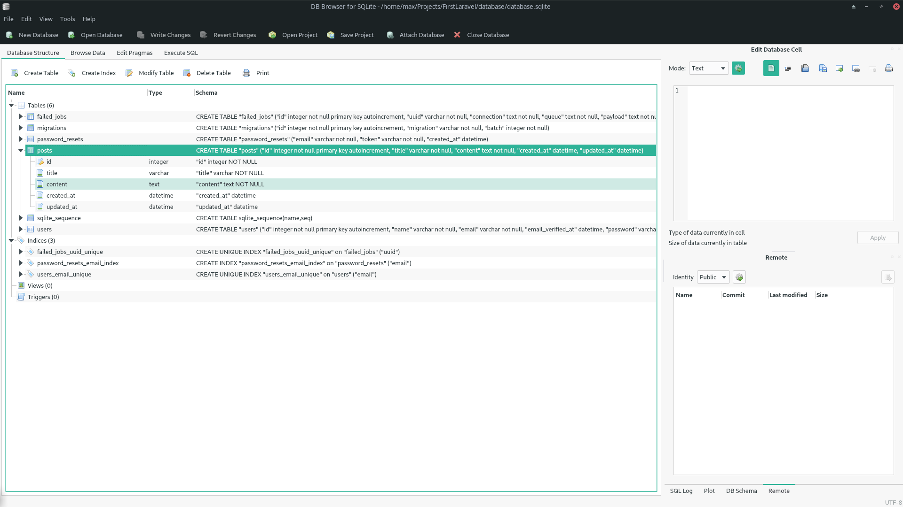
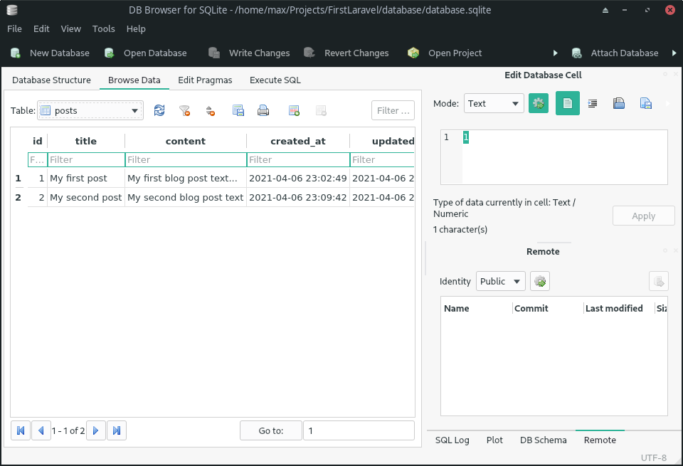

# ApiOvertimePay

Laravel 8, PHP 7.4

## Database Preview





## Routes

```
Route::get('/posts', [PostsApiController::class, 'index']);
Route::get('/post/{post}', [PostsApiController::class, 'get']);
Route::post('/posts', [PostsApiController::class, 'store']);
Route::put('/posts/{post}', [PostsApiController::class, 'update']);
Route::delete('/posts/{post}', [PostsApiController::class, 'destroy']);
```

### Laravel artisan commands

```
rm database/database.sqlite
sqlite3 database/database.sqlite "create table aTable(field1 int); drop table aTable;"
php artisan make:model Post -m
php artisan migrate
php artisan migrate:fresh
php artisan migrate:status
php artisan migrate:reset
php artisan migrate:refresh
php artisan migrate
php artisan make:controller PostsApiController
```

### Insert fake/sample data to database

After clone -> Command Line :

1. run composer install to generate depedencies in vendor folder
2. change .env.example to .env
3. run php artisan key:generate
4. configure .env
5. php artisan migrate:fresh --seed
6. php artisan serve
